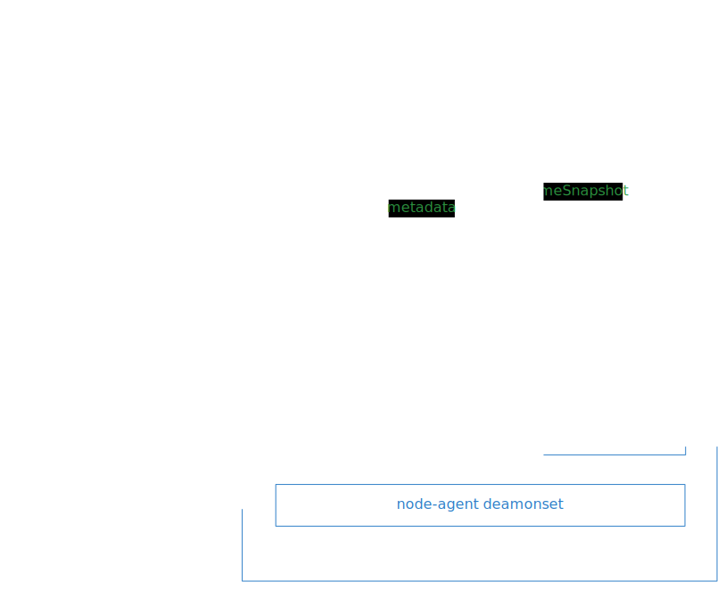

# Velero

## Stratégie de sauvegarde des volumes Kubernetes avec Velero

Velero est utilisé sur la PFC afin d’effectuer des sauvegardes du contenu des volumes attachés aux pods de la PFC.
Comme Velero nécessite des accès à l’API Kubernetes afin d’effectuer une restauration, les équipes des applications métiers ne seront pas capables de restaurer leurs volumes seules. La recommandation est donc que les applications métiers n’aient pas de volumes attachés à leurs pods contenant des données à persister. S’ils n’ont pas le choix, la restauration d’un volume passera par la création d’un ticket.

La stratégie de sauvegarde repose sur 2 destinations de stockage différentes :

- Un bucket dans la même région que le cluster, qui contient les métadonnées de la sauvegarde, et le CSI OVH qui permet de faire des VolumeSnapshots.
- Un bucket dans une autre région OVH, qui contient à la fois les métadonnées de la sauvegarde et les données des volumes sans se baser sur le CSI OVH.

⚠️ Attention : il est noté dans la documentation d’OVH que les VolumeSnapshots peuvent être indisponibles si le volume l’est également, car ils sont hébergés sur le même « cluster ».
D’où l’importance du deuxième type de sauvegarde.

Nous utilisons 2 planifications différentes qui se déclenchent au même moment afin de créer ces 2 sauvegardes de types différents.

Velero gère lui-même la rétention de ses sauvegardes. Pour faciliter la gestion du cycle de vie des sauvegardes, nous allons donc utiliser 2 planifications par type de sauvegarde.
Les fréquences choisies sont :

- une sauvegarde journalière avec une rétention d’un mois = 720h
- une sauvegarde mensuelle avec une rétention de 6 mois = 4320h

## Comment restaurer un volume grâce à Velero ?

### Introduction

Sur l’infrastructure OVH actuelle, nous utilisons 2 types de sauvegarde de volume différents pour garantir la pérennité des sauvegardes des volumes Kubernetes.
Lors d’une restauration, privilégiez les sauvegardes CSI car c’est la méthode la plus rapide et la plus simple à mettre en œuvre, puis les sauvegardes S3 si le CSI ne peut pas être utilisé.

Les sauvegardes CSI utilisent le service managé OVH de VolumeSnapshot pour effectuer des sauvegardes des volumes. Elles sont situées dans la même région et sur le même cluster physique que les volumes.
En cas de problème sur le cluster OVH de volumes, nous avons fait le choix d’effectuer des sauvegardes incrémentales dans un S3 situé dans une autre région. C’est Velero qui gère le cycle de vie des blocs sauvegardés dans le bucket S3 en utilisant Kopia.

### Limitations

Chacun des deux types de sauvegarde stocke ses métadonnées dans un bucket S3. Une limitation de Velero nous oblige aujourd’hui à n’utiliser qu’un seul utilisateur pour accéder à ces deux buckets différents. Vous pouvez utiliser la CLI Velero pour interagir via l’API Kubernetes avec le contenu de ces buckets S3.

### Prérequis

- Avoir installé la [CLI Velero](https://velero.io/docs/v1.3.0/velero-install/)
- Avoir accès à l’API Kubernetes du cluster contenant le volume que l’on souhaite restaurer, et donc utiliser une IP autorisée à accéder à l’API Kubernetes.

### Procédure de restauration d’une sauvegarde CSI


- Trouver la sauvegarde que vous souhaitez restaurer, connectez-vous au cluster Kubernetes de l’environnement concerné et exécutez cette commande :

```bash
velero backup get
```

- Notez le nom de la sauvegarde que vous souhaitez restaurer.
- Avant de pouvoir restaurer une sauvegarde via le CSI OVH, vous devez supprimer le PVC et donc le volume associé.
  - « Scalez » le déploiement ou le StatefulSet attaché au volume à 0 réplique.
  - Supprimez le PVC que vous souhaitez restaurer.
  - La suppression du PVC entraîne la suppression du volume.
    ⚠️ Cette suppression est définitive, donc n’hésitez pas à lancer une sauvegarde avant de le faire si vous avez un doute.

```bash
velero backup create --from-schedule daily-ovh-csi-backups
```

- Lancez la restauration avec Velero en exécutant la commande suivante :

```bash
velero restore create manual-restore-from-`$BACKUP_NAME` \
  --from-backup `$BACKUP_NAME` \
  --include-namespaces `$TO_RESTORE_PVC_NAMESPACE`  \
  --include-resources persistentvolumeclaims,volumesnapshots.snapshot.storage.k8s.io,volumesnapshotcontents.snapshot.storage.k8s.io
```

- Vous pouvez voir le statut de la restauration avec la commande :

```bash
velero restore describe manual-restore-from-`$BACKUP_NAME`
```

- Une fois la restauration terminée, vous pouvez remettre votre déploiement ou votre StatefulSet attaché au volume au nombre initial de répliques.

Si tout s’est bien passé, les données auront été restaurées.

### Procédure de restauration d’une sauvegarde S3

Pour la restauration utilisant Kopia, nous avons également besoin de restaurer un pod. Velero va injecter un InitContainer dans ce pod restauré, qui sera responsable de la restauration du volume attaché au pod.
La restauration d’un pod lié à un Déploiement va poser problème car le contrôleur n’appréciera pas qu’un pod supplémentaire lui soit ajouté.
Dans ce but, la restauration d’une sauvegarde S3 nécessite la suppression temporaire du Déploiement attaché au volume afin de rendre la restauration possible.



- Trouver la sauvegarde que vous souhaitez restaurer, connectez-vous au cluster Kubernetes de l’environnement concerné et exécutez cette commande :

```bash
velero backup get
```

- Notez le nom de la sauvegarde que vous souhaitez restaurer.

- Avant de pouvoir restaurer une sauvegarde S3, vous devez supprimer le PVC et donc le volume associé.
  - Il faut supprimer le Déploiement ou le StatefulSet attaché au volume (un pod sera créé lors de la restauration et le contrôleur du Déploiement ou du StatefulSet posera problème).
  - Supprimez le PVC que vous souhaitez restaurer.
  - La suppression du PVC entraîne la suppression du volume.
    ⚠️ Cette suppression est définitive, donc n’hésitez pas à relancer une sauvegarde avant de le faire.

```bash
velero backup create --from-schedule daily-ovh-s3-backups
```

- Lancez la restauration avec Velero en exécutant la commande suivante :

```bash
velero restore create manual-restore-from-`$BACKUP_NAME` \
  --from-backup `$BACKUP_NAME` \
  --include-namespaces `$TO_RESTORE_PVC_NAMESPACE` \
  --include-resources persistentvolumeclaims,pods,persistentvolumes \
  --resource-modifier-configmap remove-pvc-binding
```

Par défaut, lors de la restauration du PVC, Velero va le recréer avec le même nom de volume que lors de la sauvegarde. Or, le CSI OVH n’apprécie pas cette contrainte et bloque la création du volume.
Pour résoudre ce problème, une ConfigMap de configuration a été créée afin que, lors de leur restauration, les PVC puissent être recréés correctement.

```bash
apiVersion: v1
kind: ConfigMap
metadata:
  name: remove-pvc-binding
  namespace: velero
data:
  remove-pvc-binding.yaml: |
    # remove-pvc-binding.yaml
    version: v1
    resourceModifierRules:
    - conditions:
        groupResource: persistentvolumeclaims
      patches:
      - operation: remove
        path: /spec/volumeName
```

- Vous pouvez voir le statut de la restauration avec la commande :

```bash
velero restore describe manual-restore-from-`$BACKUP_NAME`
```

- Une fois la restauration terminée, vous pouvez recréer votre Déploiement ou votre StatefulSet attaché au volume.

Si tout s’est bien passé, les données auront été restaurées.
