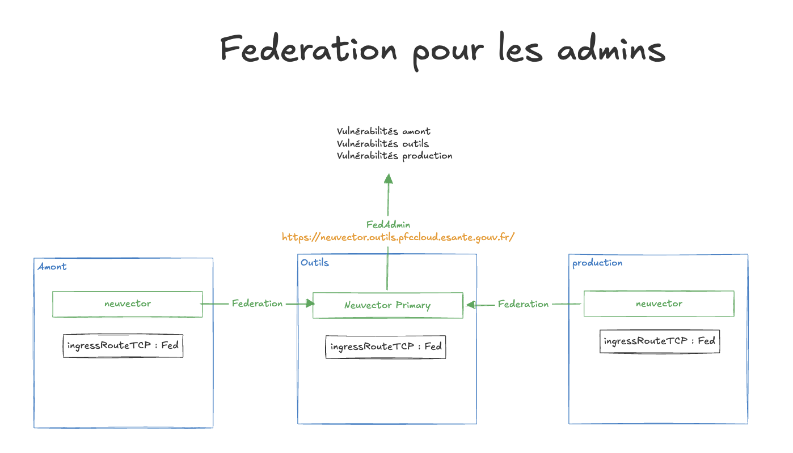
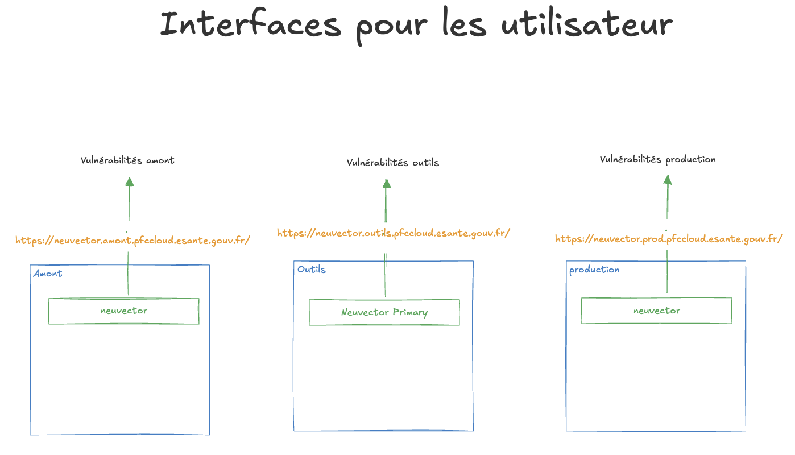
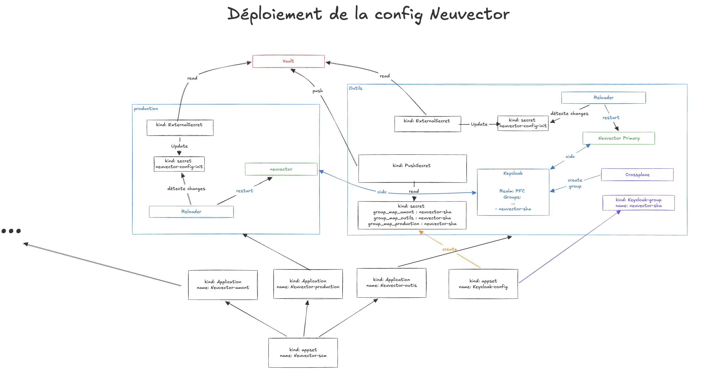
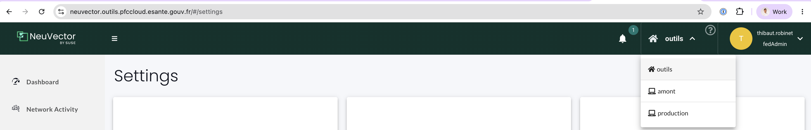

# Neuvector

Cette documentation a pour but d'expliquer les particularités de notre configuration de Neuvector sur la PFC 3AZ.

## Limitations

### Fédération des interfaces utilisateurs pour les admins



Notre objectif était de n'avoir qu'une seule interface pour voir les vulnérabilités des 3 Clusters. Cela est possible grâce à la fédération des clusters Neuvector.
Nous avons procédé à cette configuration avec le cluster `outils` en tant que Master.

### Duplication des interfaces utilisateurs



Nous avons également besoin que chaque équipe projet ne puisse accéder qu'aux vulnérabilités de son projet. Afin de réaliser cela, Neuvector propose des rôles qui sont scopés à chaque namespace. Or, ces rôles ne sont pas utilisables dans le cas de la fédération des clusters. Ceci nous a obligés à conserver une interface graphique par projet, pour pouvoir restreindre les accès des utilisateurs à leurs namespaces uniquement.

### Droits non cumulables



Neuvector permet d'associer des groupes Keycloak à des rôles Neuvector pour qu'un utilisateur puisse avoir accès seulement aux namespaces liés à son projet. Or, dans la réalité, un développeur est souvent associé à plusieurs projets. Sauf que le fonctionnement du RBAC de Neuvector ne permet pas de cumuler les rôles Neuvector ; dès qu'un des groupes Keycloak correspond à un rôle Neuvector, seul ce rôle sera pris en compte. Cela ne permet donc pas nativement de cumuler plusieurs projets.

Pour résoudre ce problème, chaque utilisateur est placé dans un groupe Keycloak `neuvector-sha` où le sha correspond au sha de tous les groupes Keycloak dans lesquels se trouve l'utilisateur. Ces groupes sont créés et associés aux utilisateurs avec l'application ArgoCD `keycloak-config`.

Pour que ces groupes Neuvector soient accessibles dans les 3 clusters, nous ajoutons cette configuration dans le Vault via un `PushSecret`. Nous récupérons ainsi la configuration OIDC de chaque Neuvector avec un `ExternalSecret`. Une fois la valeur du secret mise à jour, un redémarrage de Neuvector est nécessaire pour que la configuration OIDC soit prise en compte. Les pods de Neuvector redémarrent automatiquement grâce à Reloader qui est un controller Kubernetes fait pour ces usages. Remarque: les 3 pods du déploiement vont redémmarés, mais seul le redémarrage de l'un d'entre eux est suffisant pour recharger la nouvelle configuration de l'OIDC.

**TL;DR :** Un utilisateur aura automatiquement le droit d'accéder dans Neuvector aux namespaces de son projet au maximum 10 minutes (temps de synchronisation du PushSecret et de l'ExternalSecret) après qu'on lui ait attribué les droits dans l'application `keycloak-config`.

## Setup de la fédération

Pour mettre en place la fédération, comme il s'agit d'étapes synchrones entre tous les clusters et à n'effectuer qu'une seule fois, nous avons fait le choix de les réaliser manuellement en suivant cette section.

Définissez ces variables d'environnement pour la suite :

```bash
NV_ADMIN_PASSWORD=$(kubectl get secret neuvector-gitops-config-credentials -n neuvector -o jsonpath='{.data.admin-password}' | base64 -d)
NV_JOIN_TOKEN=$(kubectl get secret neuvector-gitops-config-credentials -n neuvector -o jsonpath='{.data.join-token}' | base64 -d)
REGISTRY_USERNAME=$(kubectl get secret neuvector-gitops-config-credentials -n neuvector -o jsonpath='{.data.registry-username}' | base64 -d)
REGISTRY_PASSWORD=$(kubectl get secret neuvector-gitops-config-credentials -n neuvector -o jsonpath='{.data.registry-password}' | base64 -d)
NV_API="https://neuvector-svc-controller-api.neuvector.svc:10443"
NV_ADMIN_USERNAME="admin"
```

### Génération d'un JoinToken dans le Primary

Dans le cluster outils, remplacer le nom du pod neuvector et executer cette commande :

```bash
kubectl debug -it pod/neuvector-controller-pod-74fd478845-4vq7t \
  --image=alpine:3.23 \
  --container="admin-neuvector-pods-$RANDOM" \
  --profile=general \
  --env="NV_ADMIN_PASSWORD=${NV_ADMIN_PASSWORD}" \
  --env="NV_JOIN_TOKEN=${NV_JOIN_TOKEN}" \
  --env="REGISTRY_USERNAME=${REGISTRY_USERNAME}" \
  --env="REGISTRY_PASSWORD=${REGISTRY_PASSWORD}" \
  --env="NV_API=${NV_API}" \
  --env="NV_ADMIN_USERNAME=${NV_ADMIN_USERNAME}" \
  -- sh
```

Dans le pod créer lancer ces commandes :

```bash
apk add curl
apk add jq
AUTH_JSON=$(curl -sk -H "Content-Type: application/json" -d '{"password": {"username": "'"$NV_ADMIN_USERNAME"'", "password": "'"$NV_ADMIN_PASSWORD"'"}}' "$NV_API/v1/auth")
TOKEN=$(echo "$AUTH_JSON" | sed -n 's/.*"token":"\([^"]*\)".*/\1/p' | head -n 1)
JOIN_TOKEN=$(curl -k -s -X GET "${NV_API}/v1/fed/join_token" -H "X-Auth-Token: ${TOKEN}" | jq -r '.join_token')
echo "Generated Join Token: ${JOIN_TOKEN}"
exit 0
```

Copier le JOIN_TOKEN pour la suite.

Attention il est recommandé de redémarrer le pod de neuvector (exemple: `pod/neuvector-controller-pod-74fd478845-4vq7t`) pour effacer les secrets qui peuvent se trouver dans les logs du container terminé.

### Rejoindre le cluster Primary

Dans le cluster amont ou production, remplacer le nom du pod neuvector et executer cette commande :

```bash
kubectl debug -it pod/neuvector-controller-pod-75cb786996-8nn9w \
  --image=alpine:3.23 \
  --container="admin-neuvector-pods-$RANDOM" \
  --profile=general \
  --env="NV_ADMIN_PASSWORD=${NV_ADMIN_PASSWORD}" \
  --env="NV_JOIN_TOKEN=${NV_JOIN_TOKEN}" \
  --env="REGISTRY_USERNAME=${REGISTRY_USERNAME}" \
  --env="REGISTRY_PASSWORD=${REGISTRY_PASSWORD}" \
  --env="NV_API=${NV_API}" \
  --env="NV_ADMIN_USERNAME=${NV_ADMIN_USERNAME}" \
  -- sh
```

Dans le pod créer lancer ces commandes : (exemple ci-dessous pour le cluster de production)

```bash
apk add curl
apk add jq
AUTH_JSON=$(curl -sk -H "Content-Type: application/json" -d '{"password": {"username": "'"$NV_ADMIN_USERNAME"'", "password": "'"$NV_ADMIN_PASSWORD"'"}}' "$NV_API/v1/auth")
TOKEN=$(echo "$AUTH_JSON" | sed -n 's/.*"token":"\([^"]*\)".*/\1/p' | head -n 1)
JOIN_TOKEN="***"
curl -k "$NV_API/v1/fed/join" \
-H "Content-Type: application/json" \
-H "X-Auth-Token: $TOKEN" \
-d '{"join_token": "'$JOIN_TOKEN'", "name": "production", "joint_rest_info": {"port": 443, "server": "fed.neuvector.prod.pfccloud.esante.gouv.fr"}}'
exit 0
```

Attention il est recommandé de redémarrer le pod de neuvector (exemple: `pod/neuvector-controller-pod-74fd478845-4vq7t`) pour effacer les secrets qui peuvent se trouver dans les logs du container terminé.

### Vérification



Dans le cluster outils, en tant que FedAdmin, vous pouvez désormais voir un sélecteur en haut à droite de votre écran vous permettant de changer de cluster. Vous devez pouvoir voir les vulnérabilités du cluster qui vient de rejoindre la fédération.
