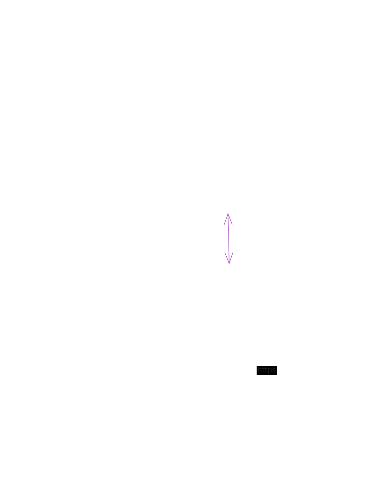
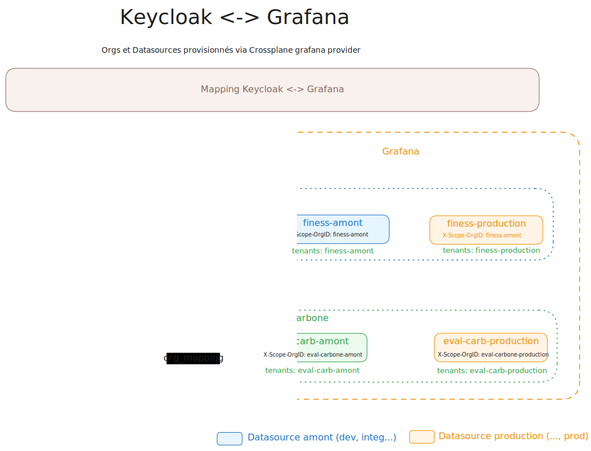

# Setup Loki et activation du logging sur une application (PFC 3AZ)

## Contexte

La collecte et l'exploitation des logs sur la PFC 3AZ reposent sur trois briques :

- **Loki** stocke et indexe les logs. Il est déployé en mode distribué sur le cluster `pfc-3az-outils` et mutualise 3 buckets S3 (`pfc-loki-chunks`, `pfc-loki-admin`, `pfc-loki-rulers`).
- **OpenTelemetry Collector** (un daemonset sur chaque cluster : amont, production, outils) collecte les logs des pods et les envoie à Loki en HTTPS, via l'ingress `traefik-internal`, sur l'endpoint OTLP `https://loki.pfccloud.esante.gouv.fr/otlp`.
- **Grafana** sert à visualiser les logs. Les accès sont isolés par **Org Grafana, une par projet** (finess, eval-carbone, mcps…). Chaque org contient 2 datasources Loki (amont et production) et un mapping entre les groupes Keycloak et l'org.

Loki est multi-tenant : chaque flux de logs est rattaché à un tenant via l'en-tête `X-Scope-OrgID`, dont la valeur suit la convention `<app_name>-<cluster>` (ex. `finess-amont`, `finess-production`).



## Fonctionnement

La collecte de logs se base sur un label posé sur le namespace. Sur les namespaces d'application, la présence du label `loki-tenant: <app_name>-<cluster>` :

- déclenche la collecte des logs des pods du namespace par OpenTelemetry
- route ces logs vers le tenant Loki correspondant (`<app_name>-amont` ou `<app_name>-production`).

Côté Grafana, un utilisateur accède aux logs de son application via l'org dédiée, à laquelle il est rattaché par son groupe Keycloak.



## Prérequis pour suivre la documentation

- Avoir accès au repository [pfc-ovh-argocd-config-infrastructure](https://github.com/ansforge/pfc-ovh-argocd-config-infrastructure)
- Avoir un compte Keycloak sur le realm PFC et appartenir à l'un des groupes Keycloak de l'application (devops ou developer)

## Activer le logging sur une application

Quatre modifications, toutes dans le repository [pfc-ovh-argocd-config-infrastructure](https://github.com/ansforge/pfc-ovh-argocd-config-infrastructure). Un commit suffit : ArgoCD synchronise puis Crossplane applique la configuration.

### 1. Labelliser le namespace de l'application

Vérifier que le(s) namespace(s) porte(nt) le label correspondant à son cluster :

- `loki-tenant: <app_name>-amont` pour le cluster amont
- `loki-tenant: <app_name>-production` pour le cluster production

Si ce n'est pas le cas, l'ajouter. (Les applications bootstrapées via le module Terragrunt `gitlab-3az-project` reçoivent ce label automatiquement.)

### 2. Créer l'org Grafana de l'application

Ajouter l'application à la liste des orgs dans `components/operationnel/grafana-config/outils/values.yaml` :

```yaml
lokiUrl: "https://loki.pfccloud.esante.gouv.fr"

orgs:
  - name: mcps
  - name: <nouvelle_app>   # <----- ajouter le nom de l'app
```

Crossplane crée alors une org pour l'application et ses 2 datasources Loki : `<app_name>-amont` et `<app_name>-production`.

### 3. Activer le scraping OTel sur le namespace

Ajouter l'application à la liste des tenants scrapés par OpenTelemetry, dans `components/operationnel/opentelemetry-operator/<amont|production>/values.yaml` (le cluster qui héberge l'application) :

```yaml
collectorLogs:
  tenants:
    - mcps
    - <nouvelle_app>   # <----- ajouter le nom de l'app à scraper
```

OpenTelemetry scrape alors tous les namespaces du cluster portant le label `loki-tenant: <nouvelle_app>-<cluster>`.

### 4. Mapper les groupes Keycloak aux org Grafana

Dans `components/operationnel/kube-prometheus-stack/outils/values/mappingKeycloakGrafana.yaml`, ajouter le mapping des groupes de l'application :

```yaml
auth.generic_oauth:
  org_attribute_path: groups
  org_mapping: >-
    grafana-admins:*:Admin
    mcps-devops:mcps:Admin
    mcps-developer:mcps:Viewer
    <app_name>-devops:<app_name>:Admin       # <----- Ajouter la nouvelle app (DevOps)
    <app_name>-developer:<app_name>:Viewer   # <----- Ajouter la nouvelle app (Dev)
```

### 5. Appliquer

Commiter l'ensemble des modifications et attendre la synchronisation ArgoCD.

Les utilisateurs des groupes `<app_name>-devops` / `<app_name>-developer` accèdent ensuite aux logs depuis [Grafana](https://grafana.pfccloud.esante.gouv.fr), dans l'org de leur application.
